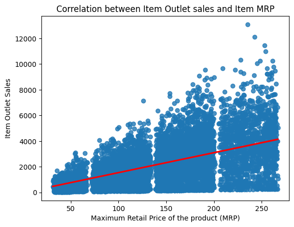

# Food Sales Predictions
## sales prediction for food items sold at various stores 

### Business problem:

When is the last time your sales hit or exceeded its quota? And how often do you achieve such a feat?

It can be frustrating to deal with continuous failures to increase your sales time and time again. It feels even worse when you have done everything you think you should improve your sales team’s performance. 

There may be other factors at play that you have not considered. Understanding how such factors affect your sales is the first step toward improving your sales as a retailer. 

The goal of this project is to help the retailer understand the properties of products and outlets that play crucial roles in increasing sales.

### Data:
Data food sales predictions [sales_predictions_2023 (2) (1).csv](https://github.com/AsmaBenHmidene/food-sales-predictions/files/12279201/sales_predictions_2023.2.1.csv)

For this dataset, there are 8523 rows and 12 columns.

## Methods
To prepare this data, the data was cleaned, and the following processes were performed:
### Exploratory Data Analysis
    - During the exploratory data analysis, boxplots and histograms were visualized for numeric datatype column. 
    - Also, barplots were visualized for categorical column. 
    - This gave a good baseline for all of the numeric and categorical columns for univariate EDA.

#### Visual 1 

> This histogram shows that the average of the sales are around $2,181.29.

## Results
 ### Expanatory Data Analysis
    - To visualize the data for explantory purposes, two bargraphs and one regplot were chosen.
    - The bargraphs were chosen to show how the categories compare to each other. 
    - Finally, a regplot was chosen to show the trend of sales when coorelated to the maximum retail price of the product. 

#### Visual 2 

>Supermarket Type3 shows the highest sales average (3700).

>Supermarket Type 1 come in the second position (2400 sales' average) even though they are the main type among all outlets(65% Vs 11% for supermarket Type3).

#### Visual 3 

>  Regular products represent the principle sales and more specifically seafood. Fruits and vegetables come in the second position even though they represent the main products offered for sales.

> For Low fat item, starchy foods represent the most selled product.

#### Visual 4 

> The scatterplot correlating Item outlet sales with item MRP shows 4 groups:
> - Items with MRP between 20 and 70 (group 1) show the lowest sales average,
> - followed by Items with MRP between 80 and 140 (group 2),
> - then Items with MRP between 140 and 200 (group 3)
> - and finally Items with sales between 210 and 270 (group 4) that represent the highest items'sales .

> There is a positive correlation between the outlet sales and MRP: The sales increase whith the increase of the MRP of the product.

## Model
 ### Maching Learning Using the Following Models:
    - Linear Regression Model
    - Decision Tree Regressor Model
 ### Models Evaluated & Results
 
- Linear Regression Model:

  - Training R^2: 0.562
  - Testing R^2: 0.567
 
  - Training RMSE: 1,139.10
  - Testing RMSE: 1,092.86
  

- Decision Tree Regressor Model:
  
  - The training r2 is: 1.0.
  - The testing r2 is: 0.176.
 
  - Training RMSE: 0.00
  - Testing RMSE: 1,507.47

- In case of the linear regression model:
  - Coefficient of Determination/R2: The model performs almost equally on the training data and the test data (R2 0.562 for training data vs. 0.567 for test data).
  - Root Mean Squared Error (RMSE) Interpretation: On average, our model is incorrect by about 1.09 thousand dollars, almost the same error value predicted with the training data (This metric penalizes larger errors).
  
This model represent a good balance between the training data and testing data prediction.

- In case of the regression tree model:
  - Coefficient of Determination/R2: The model performs much more better on the training data (R2 1.0. for training data vs. 0.176 for test data).
  - Root Mean Squared Error (RMSE) Interpretation: On average, our model is incorrect by about 1.5 thousand dollars, while the error value predicted with the training data is equal to 0.00.
  
This model is overfited, it makes good predictions on a training set, but poor predictions on a testing set.

- The Final Model Chosen is the Linear Regression Model.

## Impactful features of linear regression model:

#### Visual 5 

- the top 3 most impactful features are:
     - Outlet_Type_Supermarket
     - Item_fat_content
     - item_type_hard drinks

> All these 3 features impact positively the outlets' sales.

> The 4 types of supermarket shows an almost equal coefficients, with the supertmarket type 3 being the largest and increase the sales by 2.955715e+16.

> The 2 types of Item_fat_content (regular and low fat) shows also almost equal coefficients, with the regular item content being the largest and increase the sales by 1.357152e+16.

> Among all the Item types: Hard drinks shows the largest coefficient and increase the sales by 9.048737e+15.

## Important features of regression tree model:

#### Visual 6 

- the top 5 most important features are:
     - Item MRP
     - Outlet_Type_Grocery store
     - Item visibility
     - Outlet_Type_Supermarket Type3
     - item_Weight

## Recommendations:

The properties of products and and outlets that play crucial roles in increasing sales are as follow:

 1. Outlet types: since Supermarket Type3 shows the highest sales average (3700), it will be recommended to increase the number of this type of supermarket instead of Supermarket Type 1 which represent the main type among all outlets(65%). 
    
 2. Properties of products: Regular products represent the principle sales and more specifically seafood. Fruits and vegetables come in the second position even though they represent the main products offered for sales in the outlets. Those products are essentials for daily food consumption 
For Low fat item, starchy foods represent the most selled product.

Fruits and vegetables, seafood and starchy foods are essentials products for daily food consumption, which explain why they represent the main sales in the outlets. It is recommended to increase the quantity of seafood presented for sales because according to data, seafood are the least frequent item in all outlets. 

 4. From the correlation between outlets sales and MRP of product, we can conclude that Items with MRP between 140 and 270 represent the highest items'sales. It is recommended to increase the visibity of those products to increase outlets sales. 
 
 5. Model Performance
- Overall, the best model is definitely the linear regression model, by far it outperformed the regression tree model.

## Limitations & Next Steps

  Other factures can play an important role to confirm the proposed recommendation, for example, increasing the number of supermarket type 3 might be costy due to the dimension of those market or their location.Collecting more information will help to make a final decision. Therefore, as a next step, it will be recommended to study in deepth the sales in supermarket type 3 and considere it a model to ameliorate the sales in the other type of outlets.

### For further information

For any additional questions, please contact: Asma Ben Hmidene **asmabhpython@gmail.com**
